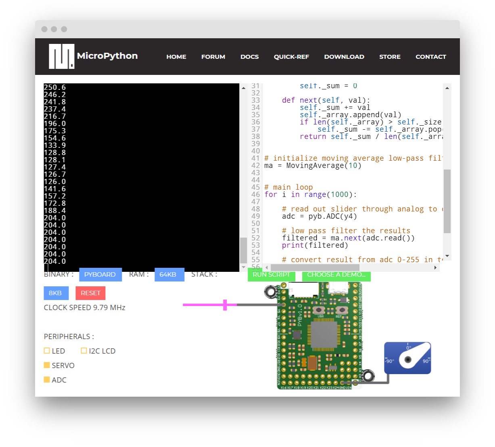

## JADS: Data-Driven Food Value Chain | Introduction to Sensors

## MicroPython Lunar Lander filter exercise

One of the main differences of coding for an MCU is that they 
offer very few resources. It is generally not possible to
use large Python libraries such Numpy or Scipy. 

The current assignment requires you to implement a filter while working around these limits.

##  Objective of the game 

The game we will adapt in this assignment simulates a lunar landing module (LLM) landing on the moon.
You are the pilot and need to control how much fuel you burn in the
retro rockets so that your descent speed slows to zero just as your
altitude above the moon's surface reaches zero. If you impact the moon
more than 5 m below the surface, or your speed on impact is
greater than 5 m/s then you have considered to have crashed.
Otherwise it is considered to be a 'good' landing.
If you run out of fuel, LLM will accelerate towards moon by gravity.

For more on the history of this simple but influential game, see, for instance: https://www.technologizer.com/2009/07/19/lunar-lander/

## Assignment

Copy-paste `lunar-lander.py`'s source code at https://micropython.org/unicorn/

Then replace the constant burn rate in line 55 with interpolated input from the virtual slider,
with some delay from a basic moving average filter (for instance with window of n = 3)

**Be careful**: _Do_ regularly copy-paste your code to an external editor.
Just like real-life microprocessors, this emulated MCU can crash and take
your code with it.

It also helps to refresh the page every now and then,
to "reset" the emulated MCU.

